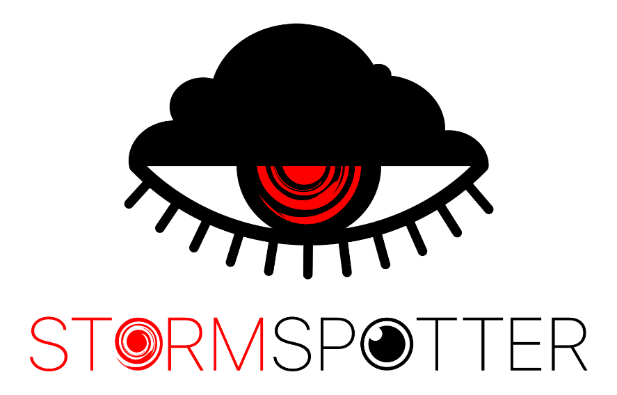
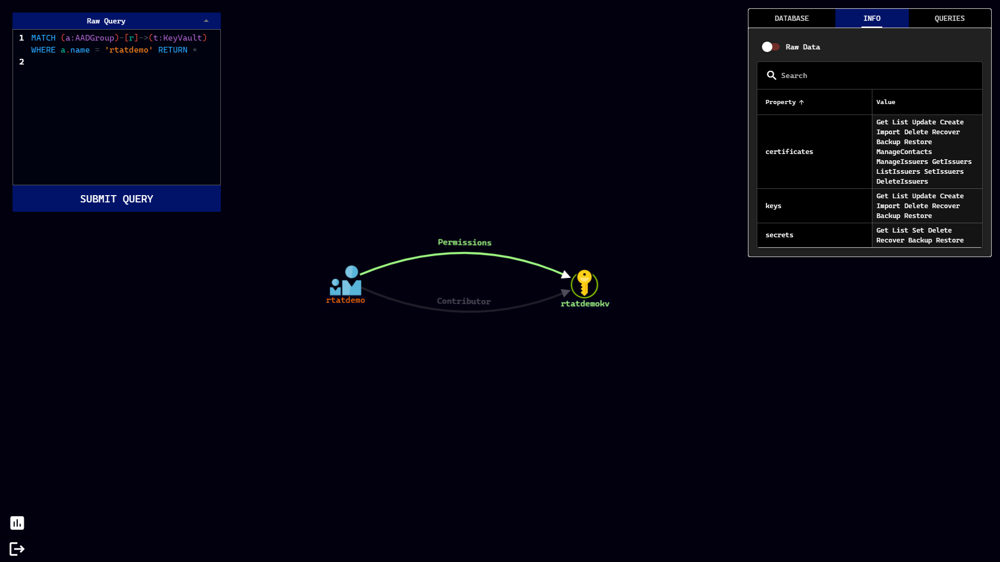
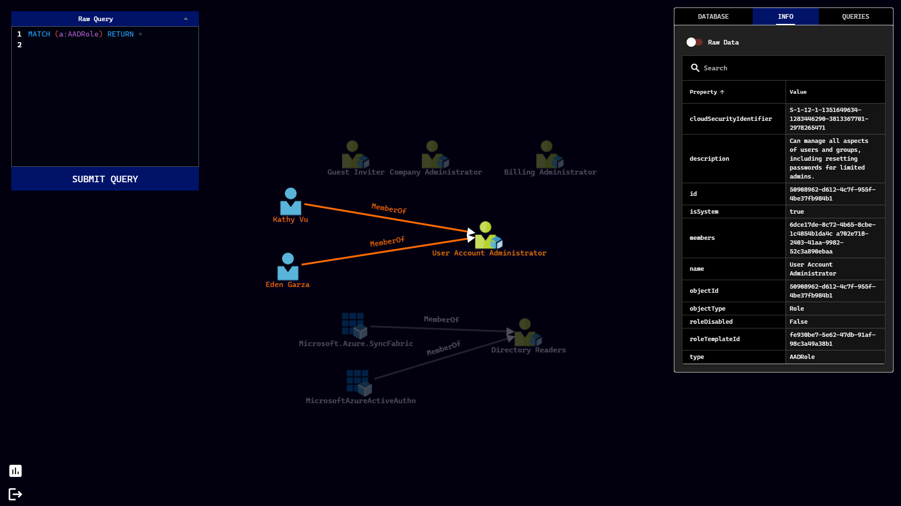
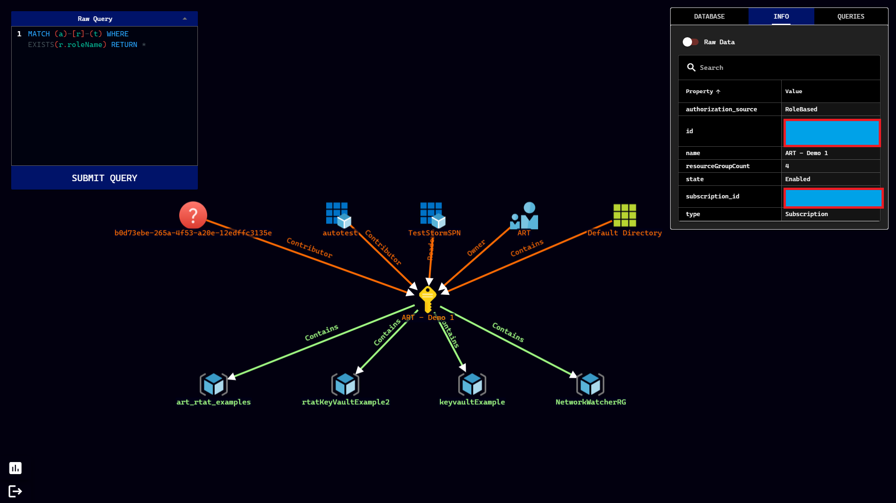

<p align="center">
    <br>
    
    
</p>

Stormspotter creates an “attack graph” of the resources in an Azure subscription. It enables red teams and pentesters to visualize the attack surface and pivot opportunities within a tenant, and supercharges your defenders to quickly orient and prioritize incident response work.

---

# Installation

## With Docker

Most users may find it easier to install Stormspotter via Docker. This is the recommended method.

```
git clone https://github.com/Azure/Stormspotter
docker-compose up
```

The `docker-compose` file will create three containers:

- Stormspotter Frontend
- Stormspotter Backend
- Neo4j v4

By default, the Stormspotter container will expose the UI on port 9091. The neo4j container will expose neo4j on ports 7474 (HTTP), and 7687 (Bolt). Default configuration of Neo4j does not have SSL enabled, therefore you may initially interact directly with the neo4j interface on port 7474.

**Note**: Currently, Stormspotter only supports running these containers locally. Attempting to upload to the frontend hosted remotely will be unsuccessful but this behavior is expected to change in the future.

The default credentials for neo4j are: **neo4j/password**. You can change this in the `docker-compose` file via the NEO4JAUTH environment variable.

## Without Docker

If you choose to run Stormspotter without Docker, you must have [Python 3.8](https://www.python.org/downloads/), [NodeJS/npm](https://www.npmjs.com/get-npm), and [Neo4j](https://neo4j.com/docs/operations-manual/current/installation/) installed. You can also grab the latest Stormspotter releases from [here](https://github.com/Azure/Stormspotter/releases).

### Backend

The backend handles parsing data into Neo4j is built with [FastAPI](https://fastapi.tiangolo.com/). If you don't plan on uploading new content for the database, you may not need to run the backend at all. The backend is configured to run on port 9090. You may change this by changing the port number on line 5 of [app.py](backend/app.py). If you do, you must also change the port in the Q-Uploader component in the [DatabaseView Component](frontend/src/components/DatabaseView.vue) so that the uploads from the frontend get sent to the correct port where the backend resides.

```
cd backend
python3 ssbackend.pyz
```

### Web App

The web app is developed using [Vue](https://vuejs.org/) and the [Quasar Framework](https://quasar.dev/). The single-page app (SPA) has been built for you and resides in `frontend/dist/spa`. To serve this directory:

```
npm install -g @quasar/cli
cd frontend/dist/spa
quasar serve -p 9091 --history
```

You can then visit http://localhost:9091 in your browser.

# Running Stormspotter

### Stormcollector

Stormcollector is the portion of Stormspotter that allows you to enumerate the subscriptions the provided credentials have access to. The **_RECOMMENDED_** way to use Stormcollector is to run the `sscollector.pyz` package, found in [the release file for your operating system](https://github.com/Azure/Stormspotter/releases/). This PYZ has been created with [Shiv](https://github.com/linkedin/shiv) and comes with all the packages already zipped up! The dependencies will extract themselves to a `.shiv` folder in the user's home directory.

```
cd stormcollector
python3 sscollector.pyz -h
```

If for some reason you don't want to use the provided package, you may install the required packages with `pip` or `pipenv`. With this approach, it's _highly recommended_ to install Stormcollector in a virtual environment to prevent package conflicts. If you have issues managing your virtual environments, you should use the recommended method above.

```
cd stormcollector
python3 -m pip install pipenv
pipenv install .
python3 ./sscollector.py
```

Current login types supported:

- Azure CLI (must use `az login` first)
- Service Principal Client ID/Secret

You can check out all of the options Stormcollector offers by using the `-h` switch as shown above. The most basic usages of Stormcollector are:

```
python3 sscollector.pyz cli
python3 sscollector.pyz spn -t <tenant> -c <clientID> -s <clientSecret>
```

**Common options for all authentication types**

- **--cloud**: Specify a different Azure Cloud (GERMAN, CHINA, USGOV)
- **--config**: Specify a custom configuration for cloud environments
- **--azure**: Only enumerate Azure Resource Manager resources
- **--aad**: Only enumerate Azure Active Directory
- **--subs**: Subscriptions you wish to scan. Multiple subscriptions can be added as a space deliminated list.
- **--nosubs**: Subscriptions you wish to exclude. Multiple subscriptions can be excluded as a space deliminated list.
- **--json**: Convert SQLite output to JSON (**WARNING: STORMSPOTTER ONLY PARSES SQLITE FORMAT** )
  - This option is useful if you want to parse the output for reasons other than Stormspotter.
- **--ssl-cert**: Specify an SSL cert for Stormcollector to use for requests. Not a common option
- **--backfill**: Perform AAD enumeration only for object IDs associated with RBAC enumeration. Only applicable when --azure is specified.

**Uploading Results**

Once you've started up the UI, you will see a section in the database tab labeled "Stormcollector Upload". Add your file to this uploader and the processing will begin. As the results get processed, you can check the backend logs to view progress, and the results should also be reflected in the same Database View tab.

# Notes

- With Stormspotter currently in beta, not all resource types have been implemented for display. You may see labels with missing icons and/or simply display the "name" and "id" fields. Over time, more resources will be properly implemented.

## Known Issues

- Check for [known issues](https://github.com/Azure/Stormspotter/issues/24) before submitting one.

# Screenshots

- **_View Permissions on a KeyVault_**
  

- **_Show Members of an Azure AD Role_**
  

- **_Show Incoming and Outgoing Relationships_**
  

# Contributing

This project welcomes contributions and suggestions. Most contributions require you to agree to a
Contributor License Agreement (CLA) declaring that you have the right to, and actually do, grant us
the rights to use your contribution. For details, visit https://cla.opensource.microsoft.com.

When you submit a pull request, a CLA bot will automatically determine whether you need to provide
a CLA and decorate the PR appropriately (e.g., status check, comment). Simply follow the instructions
provided by the bot. You will only need to do this once across all repos using our CLA.

This project has adopted the [Microsoft Open Source Code of Conduct](https://opensource.microsoft.com/codeofconduct/).
For more information see the [Code of Conduct FAQ](https://opensource.microsoft.com/codeofconduct/faq/) or
contact [opencode@microsoft.com](mailto:opencode@microsoft.com) with any additional questions or comments.
