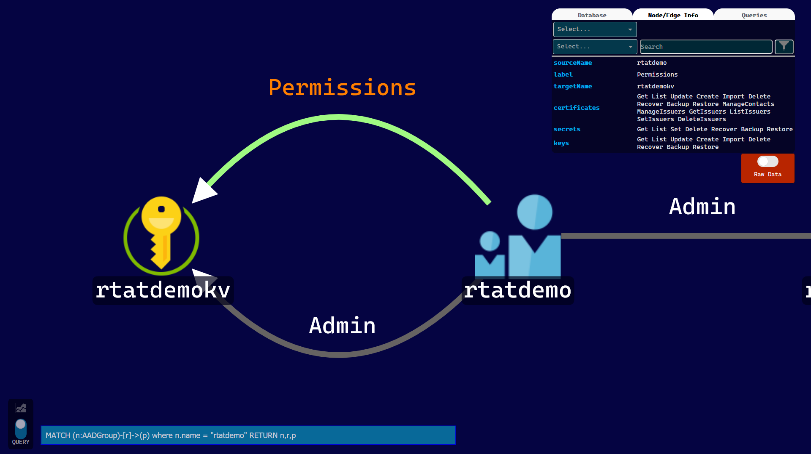
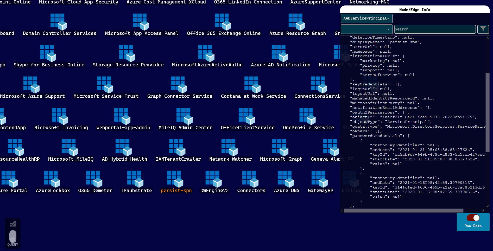
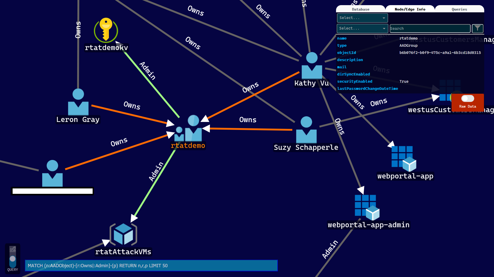

<span style="display:block;text-align:center"><br>

</span>

# Stormspotter

Stormspotter creates a neo4j graph view of you Azure subscription and assets as well as Azure AD tenants using public APIs. It needs reader access to the subscription you wish to import as well as Directory.Read access to the Azure AD tenants. 


## Getting Started

### Neo4j
Create  a local neo4j graph. This can be done locally or through docker.

#### Local installation
- Install [Neo4j Desktop](https://neo4j.com/download/)
- Create a local database (Add Graph -> Create A Local Graph)

#### Docker
```
docker run --name stormspotter -p7474:7474 -p7687:7687 -d --env NEO4J_AUTH=neo4j/[password] neo4j:latest
```

### Running Stormspotter
In order to avoid conflicting packages, it is recommended to run Stormspotter in a virtual environment.

1. Install the requirements
    ```
    pipenv install
    pip install -r requirements.txt
    ```

#### Providing credentials
Current login types supported: 

- Azure CLI (must use `az login` first)
- Service Principal Client Id/Secret

#### Gather and view resources

1. Run stormspotter to gather resource and object information
    ```
    python stormspotter.py --cli
   ```

2. Run stormdash to launch dashboard
    ```
    python stormdash.py -dbu <neo4j-user> -dbp <neo4j-pass>
    ```

3. Place results zipfile into `data/input` folder. You may also place the zipfile into the folder before running `stormdash` and it will be processed.
   
# Screenshots





# Contributing

This project welcomes contributions and suggestions.  Most contributions require you to agree to a
Contributor License Agreement (CLA) declaring that you have the right to, and actually do, grant us
the rights to use your contribution. For details, visit https://cla.opensource.microsoft.com.

When you submit a pull request, a CLA bot will automatically determine whether you need to provide
a CLA and decorate the PR appropriately (e.g., status check, comment). Simply follow the instructions
provided by the bot. You will only need to do this once across all repos using our CLA.

This project has adopted the [Microsoft Open Source Code of Conduct](https://opensource.microsoft.com/codeofconduct/).
For more information see the [Code of Conduct FAQ](https://opensource.microsoft.com/codeofconduct/faq/) or
contact [opencode@microsoft.com](mailto:opencode@microsoft.com) with any additional questions or comments.
